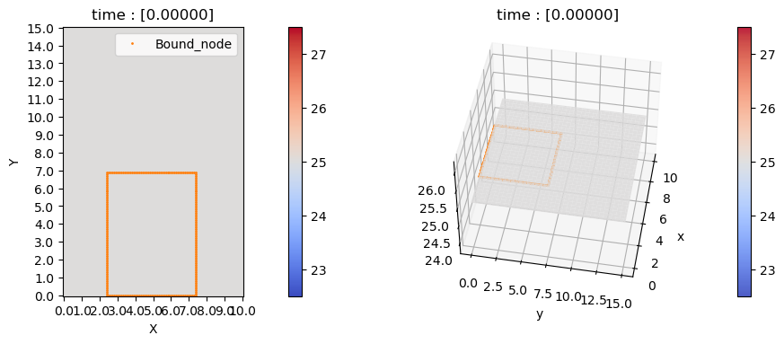

# Fin analysis using finite element method (FEM)
- github repository for computational physics, final project [2023.06.14]

# How to use it
1. [import FEM_2D](#1-import-fem-2d)

2. [set mesh's boundary](#2-set-meshs-boundary)

3. [build mesh](#3-build-mesh)

4. [set mesh's geometry](#4-set-meshs-geometry)

5. [set boundary condition](#5-set-boundary-condition)

6. [compile and check the model](#6-compile-and-check-the-model)

7. [compute or animate mesh](#7-compute-or-animate-mesh)

8. [plot computation process](#8-plot-computation-process)

9. [save and import result](#9-save-and-import-result)


## 1. import FEM 2D
FEM_2D folder should be exists in current directory like below.

<p align="center">
    
</p>

In main.ipynb, you can import FEM_2D like below.

```python
from FEM_2D import *

Test_fin = FEM_2D(*args)
```


## 2. set mesh's boundary
Before you define mesh, you should define the boundary.

```python
Test_fin = FEM_2D(X=x_max, Y=y_max, dx=unit_x, dy=unit_y)
```

Here `X` represent the maximum boundary of mesh along X axis, and `Y` represent the maximum of Y axis.

`dx` and `dy` represent the unit length of mesh, so the size of one element of mesh will be `dx * dy`. It would be better to equalize `dx`, `dy` in most case.

So when you set `(X=10, Y=15, dx=0.1, dy=0.1)`, your mesh will be set like this.

<p align="center">
    
</p>

```python
from FEM_2D import *

Test_fin = FEM_2D(X=10, Y=15, dx=0.1, dy=0.1)
Test_fin.build_mesh(1, 1, 1, 10, 10)
Test_fin.plot_status_2D()
```

Above figure can be ploted after `build_mesh` method.


## 3. build mesh
You should `build_mesh` after infix mesh boundary. `build_mesh` method set the other conditions like,
- Thermal conductivity of fin   :   `k`
- Thermal diffusivity of fin    :   `alpha`
- Initial temperature of fin    :   `T_mat`
- Convection heat transfer coefficient of surrounding air   :   `h`
- Temperature of surrounding air    :   `T_inf`

(all parameters are SI-unit)

If you skip this step, FEM_2D will not compute, since there's no information to compute.

For exmaple, thermal conductivity and diffusivity of aluminum is about $\mathrm{237 \ W/m \cdot k}, \ \mathrm{9.7857*10^{-5} m^{2}/s}$.

Also the convection heat transfer of free air is about $\mathrm{2.5 \sim 25 \ W/m^{2}\cdot k}$

Let assume fin is made of aluminum, temperature of air and fin are $\mathrm{25^\circ C}$, convection heat transfer coefficent is $\mathrm{20 \ W/m^{2}\cdot k}$.

Then we can build mesh like this.

```python
Test_fin.build_mesh(k=237, alpha=9.7857e-05, h=20, T_mat=25, T_inf=25)
```

After building mesh, now you can observe the whole mesh, using`plot_status`, `plot_status_2D`, `plot_status_3D`.

`plot_status` will show you both 2-dimensional and 3-dimesnional mesh in same figure.

```python
Test_fin.plot_status()
```
<p align="center">
    
</p>

Since we didn't fix the geometry of fin, every mesh temperature are set to `T_inf`. If you add geometry, it will automatically set to `T_mat`.


## 4. set mesh's geometry
There are three geometries in FEM_2D.
- Rectangular fin   :   `set_rect(x_mid_cord, L, H)`
- Half-circle fin   :   `set_circle(x_mid_cord, R)`
- Triangular fin    :   `set_triangular(x_mid_cord, base, height)`

Every geometry are fixed at $\mathrm{Y=0}$ axis. You can adjust the center $\mathrm{x}$ cordinate of geometry.

If geometry is out of mesh boundary, it will raise `AssertionError` : `geometry is out of mesh`.

After fix the geometry, you can plot the boundary of fin, using `plot_status(show_node=True)`.

```python
Test_fin = FEM_2D(X=10, Y=15, dx=0.1, dy=0.1)
Test_fin.build_mesh(k=237, alpha=9.7857e-05, h=20, T_mat=25, T_inf=25)
Test_fin.set_rect(x_mid_cord=5, L=5, H=7)
Test_fin.plot_status(show_node=True)
```

<p align="center">
    
</p>

Since we set `x_mid_cord=5`, center $\mathrm{x}$ cordinate of geometry will be `5`.

Also we set `T_mat = T_inf = 25`. Therefore temperature grid of fin and air are same. If we set different temperature, it would be like this

```python
Test_fin = FEM_2D(X=10, Y=15, dx=0.1, dy=0.1)
Test_fin.build_mesh(k=237, alpha=9.7857e-05, h=20, T_mat=30, T_inf=25)
Test_fin.set_rect(x_mid_cord=5, L=5, H=7)
Test_fin.plot_status(show_node=True)
```

<p align="center">
    
</p>


## 5. set boundary condition
Now we can set boundary condition. Since three geometries, `set_rect`, `set_circle`, `set_triangle` are fixed at $\mathrm{Y = 0}$ axis, boundary condition should be set at `Y=[0]`.

For now, we only implemented constant temperature boundary condition, `set_BC_const_T`.

You can set condition like below.

```python
Test_fin = FEM_2D(X=10, Y=15, dx=0.1, dy=0.1)
Test_fin.build_mesh(k=237, alpha=9.7857e-05, h=20, T_mat=30, T_inf=25)
Test_fin.set_rect(x_mid_cord=5, L=5, H=7)
Test_fin.set_BC_const_T()
```

<p align="center">
    
</p>

It would be much instuitive to check the mesh using `plot_status` or others.


## 6. compile and check the model
After fixing geometry and boundary condition, you should compile your status.

```python
Test_fin.compile()
```

`compile` method will check whether mesh proper or not. After `compile`, you can estimate number of computation, using `is_good(dt, T_end)`.

```python
dt = 0.01
T_end = 10
Test_fin.is_good(dt, T_end)
```


    Output : 
    [Safe to compute]
        ==> [3570]        nodes to calculate.
        ==> [1000]        frames to repeat
        ==> [3.57e+06]    times to calculate.
        ==> [5m 57.0s]    estimated.

(estimated time can be differ by computer performance.)

Note that you should set proper `dt`. In finite element method at transient heat transfer, [Fourier number](https://en.wikipedia.org/wiki/Fourier_number) is important factor. 

In `FEM_2D`, [Fourier number](https://en.wikipedia.org/wiki/Fourier_number), is defined as $\mathrm{Fo = \frac{\alpha\Delta t}{dx*dy}}$. Also in `FEM_2D` we calculate every nodes via 4 adjacent node, which implies $\mathrm{1 - 4Fo \geq 0}$ to satisfy analystic stability.

If you want details about it, check the [reference](#reference) - `p.330 ~ 334`.


If you set improper `dt`, it would raise `ArithmeticError`, and shows current `Fo`. For example,

```python
dt = 50         # too large dt
T_end = 1000
Test_fin.is_good(dt, T_end)
```

    Output : 
        79 self.__Fo = self.__alpha * dt / (self.dx * self.dy)
        81 if 1 - 4 * self.__Fo < 0 : 
    ---> 82     raise ArithmeticError("Fourier number has to be small enough : [{}]".format(1 - 4 * self.__Fo))
        84 self.__is_safe(1)
        85 self.__is_safe(2)

    ArithmeticError: Fourier number has to be small enough : [-0.9571399999999994]

Since `Fo = alpha * dt / (dx * dy)`, you need to decrease `dt` or increase mesh size `dx`, `dy` at [`FEM_2D(X,Y,dx,dy)`](#2-set-meshs-boundary).


## 7. compute or animate mesh
There are 3 ways to compute mesh. 
- `compute_dt(dt, save_process)`
- `compute(t_end, dt, save_process)`
- `compute_steady_state(dt, tol, max_iter, save_process)`

---
`compute_dt` method only computes one step of `dt`. 

```python
Test_fin.compute_dt(dt, save_process)
```

---
`compute` method calculates mesh until `t_end`. However in `FEM_2D`, there's a variable called `time`, shows how much time has been passed at its' initial condition. So if you set lower `t_end` than `FEM_2D.time`, it will computes nothing.

```python
Test_fin.compute(t_end, dt, save_process)
```

<p align="center">
    
</p>

---
`compute_steady_state` computes mesh over `max_iter` times steps of `dt`. If the fin reaches steady state in iteration, it will stop calculation.


```python
Test_fin.compute_steady_state(dt, tol, max_iter, save_process)
```

<p align="center">
    
</p>

Ther precision in each interation is defined as $\mathrm{\vert \frac{(T_{avg}^{t}) \ - \ (T_{avg}^{t-1})}{dt} \vert }$. So in iteration if $\mathrm{\vert \frac{T_{avg}^{t} \ - \ T_{avg}^{t-1}}{dt} \vert \leq tolerance}$, we assume it reaches steady state.

---
Above computation `compute_dt`, `compute`, `compute_steady_state` only calculate mesh, so we can save computation. However one might want to visualize the calculation process.

So there are 3 method to animate the process.
- `Animate_2D(t_end, dt, save_process, file_name)`
- `Animate_3D(t_end, dt, save_process, file_name)`
- `Animate(t_end, dt, save_process, file_name)`

`Animate_2D` save process via 2-dimensional plot, and `Animate_3D` via 3-dimensional.

`Animate` save process both 2 and 3-dimensional plot.

```python
Test_fin.Animate(t_end, dt, save_process, file_name)
```
<p align="center">
    
</p>

Those methods use [`FuncAnimation`](https://matplotlib.org/stable/api/_as_gen/matplotlib.animation.FuncAnimation.html) of [`Matplotlib`](https://matplotlib.org/stable/index.html) library to animate process.

Basically it save the ploted figure in every iteration, so it would take much more time to compute given `t_end`.

Also `Animate` saves process to `.gif` format, which restrict frames per seconds. So even if you done `Animate`, the animation could be extremely slow, if you have many frames in `.gif` files.

--> It is not recommended for many computing iterations.


## 8. plot computation process
At `compute_dt`, `compute`, `compute_steady_state`, `Animate_2D`, `Animate_3D`, `Animate` methods, there's a parameter called `save_process`.

`save_process` make the model to save average temperature of fin in each computation. 

You can plot the computation process using `plot_process` method.

For example, if parameter `save_process=False`, it can't plot the process.

```python
Test_fin.compute(T_end, dt, save_process=False)
Test_fin.plot_process('--')
```

    Output : 
    Computing mesh... [\][=================================================> ][98/100]			
    Computing has been finished.
    Mesh is on initial state. No process has been excuted.

If not, you can plot the process.
```python
Test_fin.compute_steady_state(dt)
Test_fin.plot_process('--')
```

    Output : 
    [Safe to compute]
        ==> [1276]        nodes to calculate.
        ==> [999499]      frames to repeat
        ==> [1.28e+09]    times to calculate.
        ==> [35h 25m 36.1s] estimated.
    Computing mesh... [/] --> [AVG temperature : 45.54612][>                             ][4524/1000000]			

    Temperature has been converged.
    [11.40750] sec to converge.

    Precision : [9.976020010071807e-10]
        ==> previous temperature :  [45.54612]               
        ==> current temperature :  [45.54612]               

    Computing has been finished.

<p align="center">
    
</p>


## 9. save and import result
You can save the mseh and computation process, using `save_result` method.

`save_result` save the mesh grid and others as `.npz` format. `.npz` is a file format used in the [`NumPy`](https://numpy.org/doc/stable/index.html) library, allows you to compressed  one or more `np.array` in a single file.

```python
Test_fin.save_result(file_name)
```

    Output : 
    T_mesh has been saved at : [{current directory}/file_name.npz]

You can import the result using `import_result` method. You can import the result as a `np.array` or you can replace mesh grid to given `file`.

```python
Test_fin.import_result(file="{file_name}.npz", replace_model=True)
```

    Output : 
    Mesh and result has been replaced by imported data.

Given file `.npz` should have specific keyword, `process_time`, `process_avg`, `T_mesh`.

If not, it will raise `KeyError` :  `File format doesn't match with FEM_2D`

If you replace your mesh, you can also use `plot_process` to plot previous progress.

```python
Test_fin.import_result(file="{file_name}.npz", replace_model=True)
Test_fin.plot_process()
```

<p align="center">
    
</p>

## Reference
Bergman, T. L., and Frank P. Incropera. Fundamentals of Heat and Mass Transfer. Seventh edition. Wiley, 2011.
